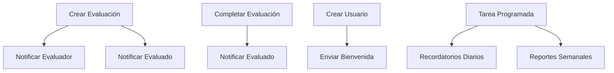

# 📧 Guía de Implementación del Sistema de Notificaciones

## 🎯 Visión General

Sistema centralizado de notificaciones por correo electrónico para el Sistema de Evaluación de Desempeño, diseñado para mantener informados a todos los usuarios sobre eventos importantes.

## 🏗️ Arquitectura

### Componentes Principales

1. **NotificationService** (`src/services/notificationService.js`)
   - Servicio centralizado para todas las notificaciones
   - Plantillas HTML profesionales y responsive
   - Manejo de errores y logging

2. **ReminderService** (`src/services/reminderService.js`)
   - Tareas programadas automáticas
   - Recordatorios diarios y reportes semanales
   - Integración con node-cron

3. **Integración en Controladores**
   - Evaluaciones: Creación y completado
   - Usuarios: Creación y bienvenida
   - Autenticación: Restablecimiento de contraseña

## 📋 Tipos de Notificaciones

### 1. Evaluaciones
- **Nueva Evaluación Asignada** 
  - Para: Evaluador y Evaluado
  - Momento: Al crear la evaluación
  - Contenido: Detalles, formulario, fechas

- **Recordatorio de Evaluación**
  - Para: Evaluador
  - Momento: 3 días antes del vencimiento
  - Contenido: Alerta de proximidad

- **Evaluación Completada**
  - Para: Evaluado
  - Momento: Al finalizar la evaluación
  - Contenido: Resultados y valoración

### 2. Usuarios
- **Bienvenida**
  - Para: Nuevo usuario
  - Momento: Al crear la cuenta
  - Contenido: Credenciales y guía de inicio

- **Restablecimiento de Contraseña**
  - Para: Usuario que solicita
  - Momento: Al solicitar recuperación
  - Contenido: Enlace seguro de reset

### 3. Administración
- **Reporte Semanal**
  - Para: Administradores
  - Momento: Cada lunes a las 8 AM
  - Contenido: Estadísticas y estado general

## ⚙️ Configuración

### Variables de Entorno Requeridas

```env
# Configuración de Correo Electrónico 
EMAIL_HOST=smtp.zoho.com
EMAIL_PORT=587
EMAIL_USER=desarrollo@solucionescorp.com.co
EMAIL_PASS=KjwjyuCYwjuY
EMAIL_SECURE=false
EMAIL_FROM=desarrollo@solucionescorp.com.co

# Configuración del remitente
APP_EMAIL=no-reply@solucionescorp.com
APP_NAME="Sistema de Evaluación de Desempeño"

# URLs para enlaces en correos
FRONTEND_URL=http://localhost:3000
CLIENT_URL=http://localhost:3000
```

### Dependencias Necesarias

```bash
npm install node-cron@^3.0.3
```

## 🔧 Instalación y Configuración

### 1. Instalar Dependencias
```bash
npm install node-cron@^3.0.3
```

### 2. Verificar Configuración de Correo
Asegúrate que las variables de entorno en `.env` estén correctamente configuradas.

### 3. Reiniciar el Servidor
```bash
npm run dev
```

El sistema iniciará automáticamente:
- ✅ Servicio de notificaciones
- ✅ Tareas programadas
- ✅ Recordatorios automáticos

## 📊 Flujo de Notificaciones



## 🎨 Plantillas de Correo

### Características
- ✅ Diseño responsive y moderno
- ✅ Colores corporativos consistentes
- ✅ Enlaces funcionales al frontend
- ✅ Información clara y estructurada
- ✅ Identificación visual del tipo de notificación

### Personalización
Las plantillas usan variables dinámicas:
- Nombre del destinatario
- Detalles específicos del evento
- Enlaces directos a acciones
- Fechas y períodos relevantes

## 🚀 Mejores Prácticas

### 1. Manejo de Errores
- Las notificaciones no fallan el proceso principal
- Logging detallado para debugging
- Reintentos automáticos para errores temporales

### 2. Performance
- Envío asíncrono de correos
- No bloquear procesos principales
- Optimización de consultas a BD

### 3. Seguridad
- No incluir información sensible
- Enlaces temporales con expiración
- Validación de destinatarios

## 🔍 Monitoreo y Logs

### Logs Activos
- ✅ Envío exitoso de notificaciones
- ❌ Errores en envío de correos
- 📊 Estadísticas de recordatorios
- ⏰ Ejecución de tareas programadas

### Métricas Importantes
- Tasa de entrega de correos
- Tiempo de respuesta del servicio
- Frecuencia de recordatorios
- Errores por tipo de notificación

## 🛠️ Mantenimiento

### Tareas Programadas
- **Diarias**: 9 AM - Recordatorios de evaluaciones
- **Semanales**: Lunes 8 AM - Reportes a administradores

### Limpieza Automática
- Tokens expirados de restablecimiento
- Logs antiguos (más de 30 días)
- Cache de notificaciones temporales

## 🔄 Actualizaciones Futuras

### Mejoras Planificadas
- 📱 Notificaciones push (opcional)
- 📊 Dashboard de estadísticas de notificaciones
- 🎯 Preferencias de usuario para notificaciones
- 📈 Reportes personalizados por departamento

### Extensiones Posibles
- Integración con Slack/Teams
- SMS para notificaciones críticas
- Calendario integrado
- Sistema de encuestas de satisfacción

## 📞 Soporte

### Problemas Comunes
1. **Correo no llega**: Verificar configuración SMTP
2. **Enlaces rotos**: Revisar URLs en variables de entorno
3. **Tareas no ejecutan**: Verificar zona horaria y permisos

### Debugging
- Revisar logs del servidor
- Probar conexión SMTP manualmente
- Verificar tareas cron activas

---

## 📝 Resumen de Implementación

El sistema está diseñado para ser:
- **Escalable**: Maneja crecimiento de usuarios y evaluaciones
- **Confiable**: Manejo robusto de errores y reintentos
- **Profesional**: Diseño moderno y consistente
- **Automático**: Mínima intervención manual requerida
- **Integrado**: Trabaja sin problemas con el sistema existente

**Estado**: ✅ Completado y listo para producción
